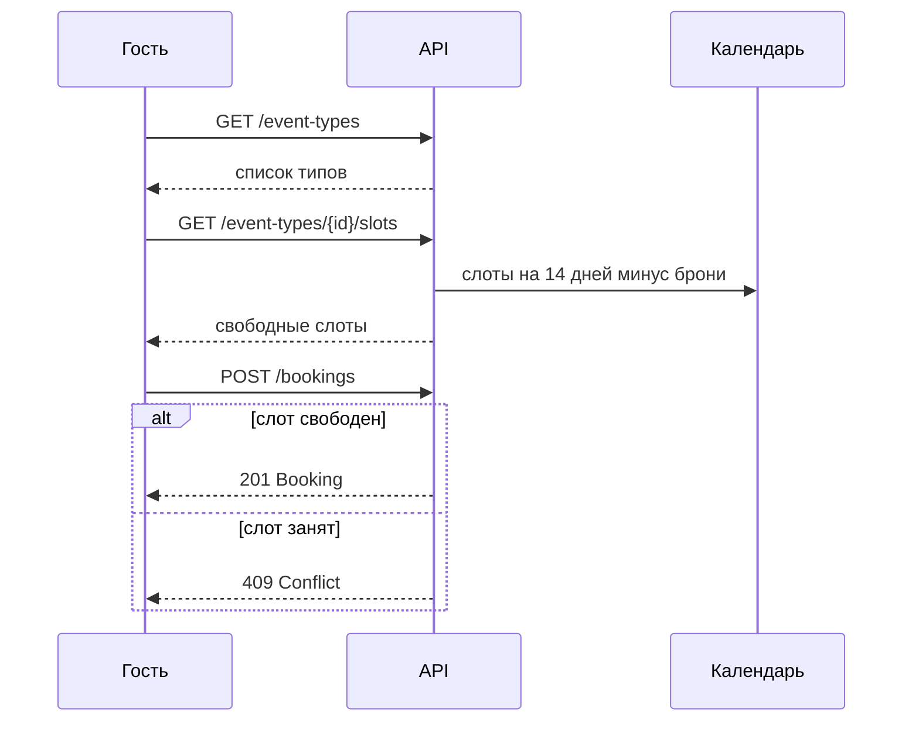

# Календарь звонков — документация API

Упрощённый аналог [Cal.com](https://cal.com/) для бронирования встреч. В проекте описан **API-контракт** на языке [TypeSpec](https://typespec.io/); из него генерируется OpenAPI 3.1.

**Версия API:** `0.1.0`  
**Base URL:** `https://bookcalls_hexlet_example.ru`

---

## Содержание

1. [Обзор приложения](#обзор-приложения)
2. [Роли](#роли)
3. [Доменные сущности](#доменные-сущности)
4. [Бизнес-правила](#бизнес-правила)
5. [Сценарии использования](#сценарии-использования)
6. [REST API](#rest-api)
7. [Модели данных](#модели-данных)
8. [Ошибки](#ошибки)
9. [Структура проекта](#структура-проекта)
10. [Сборка и генерация OpenAPI](#сборка-и-генерация-openapi)
11. [Покрытие требований](#покрытие-требований)
12. [Вне scope](#вне-scope)

---

## Обзор приложения

Сервис позволяет одному владельцу календаря настраивать **типы событий** (консультация 30 мин, звонок 15 мин и т.д.), а **гостям** — без регистрации выбирать тип, смотреть свободные слоты и создавать бронирование.

Ключевые ограничения MVP:

- **Нет регистрации и авторизации** — владелец один, задан заранее; гость не создаёт аккаунт.
- **Окно записи** — 14 календарных дней от текущей даты.
- **Глобальная занятость** — на одно и то же время нельзя создать две записи, даже если типы событий разные.

---

## Роли

### Владелец календаря (Owner)

- Единственный профиль с фиксированным `id = "default"`.
- Используется неявно в admin-части приложения.
- Может создавать, просматривать, изменять и удалять типы событий.
- Может просматривать список предстоящих встреч всех типов в одном месте.

### Гость (Guest)

- Не регистрируется и не входит в систему.
- Просматривает доступные типы событий (название, описание, длительность).
- Выбирает тип, открывает календарь слотов и создаёт бронирование, указав имя и email.

---

## Доменные сущности

### Owner — владелец календаря

| Поле | Тип | Описание |
|------|-----|----------|
| `id` | `"default"` | Фиксированный идентификатор единственного владельца |
| `displayName` | `string` | Отображаемое имя на публичной странице |

Владелец не хранит расписание напрямую — он задаёт типы событий, а слоты вычисляются backend-ом.

### EventType — тип события

| Поле | Тип | Описание |
|------|-----|----------|
| `id` | `string` | Slug, задаётся владельцем при создании (используется в URL) |
| `title` | `string` | Название |
| `description` | `string` | Описание |
| `durationMinutes` | `int32` | Длительность в минутах (5–480) |

Длительность определяет размер каждого слота при генерации календаря.

### Slot — слот (вычисляемая сущность)

**Не хранится в базе данных.** Формируется на лету backend-ом.

| Поле | Тип | Описание |
|------|-----|----------|
| `startAt` | `utcDateTime` | Начало интервала |
| `endAt` | `utcDateTime` | Конец интервала (`startAt + durationMinutes`) |
| `available` | `boolean` | `true`, если слот свободен и попадает в окно записи |

Слот считается свободным, если:

1. Попадает в окно **14 дней** от текущей даты.
2. Не пересекается ни с одним существующим бронированием (любого типа).

Генерация слотов на backend (не часть HTTP-контракта, но зафиксировано в описании API):

- Рабочие часы: **09:00–18:00 UTC**
- Шаг сетки: **`durationMinutes`** выбранного типа события

В ответе `GET .../slots` клиенту возвращаются только слоты с `available = true`.

### Booking — бронирование

| Поле | Тип | Описание |
|------|-----|----------|
| `id` | `string` | Уникальный идентификатор бронирования |
| `eventTypeId` | `string` | ID типа события |
| `eventTypeTitle` | `string` | Название типа (денormalized для списков) |
| `startAt` | `utcDateTime` | Начало встречи |
| `endAt` | `utcDateTime` | Конец (`startAt + durationMinutes`) |
| `guestName` | `string` | Имя гостя |
| `guestEmail` | `string` | Email гостя |
| `createdAt` | `utcDateTime` | Время создания записи |

При создании гость передаёт `eventTypeId`, `startAt`, `guestName`, `guestEmail`. Поле `endAt` вычисляется сервером.

---

## Бизнес-правила

| # | Правило | Где применяется |
|---|---------|-----------------|
| 1 | Окно записи — **14 дней** от текущей даты | `GET .../slots`, `POST /bookings` |
| 2 | Даты вне окна → **400 ValidationError** | `POST /bookings` |
| 3 | На одно время — **одна запись** глобально | `POST /bookings` → **409 Conflict** |
| 4 | `endAt` = `startAt + durationMinutes` типа события | `POST /bookings` |
| 5 | Предстоящие встречи: `startAt >= now()`, сортировка по `startAt` asc | `GET /admin/bookings` |
| 6 | Дублирующий `id` типа события → **409 Conflict** | `POST /admin/event-types` |
| 7 | Несуществующий тип события → **404 NotFoundError** | операции с `{eventTypeId}` |

---

## Сценарии использования

### Сценарий владельца

```
1. POST /admin/event-types          → создать тип «Консультация 30 мин»
2. GET  /admin/event-types          → просмотреть все типы
3. PATCH /admin/event-types/{id}    → изменить описание или длительность
4. DELETE /admin/event-types/{id}   → удалить тип
5. GET  /admin/bookings             → страница предстоящих встреч
```

### Сценарий гостя

```
1. GET  /event-types                → страница выбора вида брони
2. GET  /event-types/{id}           → детали выбранного типа
3. GET  /event-types/{id}/slots     → календарь свободных слотов (14 дней)
4. POST /bookings                   → записаться на выбранный слот
```



---

## REST API

Эндпоинты сгруппированы тегами **Public** и **Admin** в OpenAPI.

### Public — для гостей

#### `GET /owner`

Возвращает профиль единственного владельца календаря.

**Ответ `200`:** `Owner`

---

#### `GET /event-types`

Список всех типов событий для страницы выбора вида брони.

**Ответ `200`:** `EventType[]`

---

#### `GET /event-types/{eventTypeId}`

Детали типа события по идентификатору.

| Параметр | Расположение | Описание |
|----------|--------------|----------|
| `eventTypeId` | path | ID типа события |

**Ответы:** `200 EventType` · `404 NotFoundError`

---

#### `GET /event-types/{eventTypeId}/slots`

Свободные слоты для выбранного типа события.

| Параметр | Расположение | Обязательный | Описание |
|----------|--------------|--------------|----------|
| `eventTypeId` | path | да | ID типа события |
| `from` | query | нет | Начало диапазона (по умолчанию — сегодня) |
| `to` | query | нет | Конец диапазона (по умолчанию — сегодня + 14 дней) |

**Ответы:** `200 SlotsResponse` · `404 NotFoundError`

**Пример ответа:**

```json
{
  "windowStart": "2026-05-31",
  "windowEnd": "2026-06-14",
  "items": [
    {
      "startAt": "2026-06-01T09:00:00Z",
      "endAt": "2026-06-01T09:30:00Z",
      "available": true
    }
  ]
}
```

---

#### `POST /bookings`

Создаёт бронирование на выбранный слот.

**Тело запроса:** `CreateBookingRequest`

```json
{
  "eventTypeId": "consultation-30",
  "startAt": "2026-06-01T09:00:00Z",
  "guestName": "Иван Петров",
  "guestEmail": "ivan@example.com"
}
```

**Ответы:**

| Код | Тело | Причина |
|-----|------|---------|
| `201` | `Booking` | Бронирование создано |
| `400` | `ValidationError` | Некорректные данные или слот вне окна 14 дней |
| `404` | `NotFoundError` | Тип события не найден |
| `409` | `ConflictError` | Слот уже занят |

---

### Admin — для владельца

> Авторизация не моделируется в контракте. Защита admin-эндпоинтов — задача реализации backend.

#### `GET /admin/event-types`

Список всех типов событий.

**Ответ `200`:** `EventType[]`

---

#### `POST /admin/event-types`

Создаёт новый тип события.

**Тело запроса:** `CreateEventTypeRequest`

```json
{
  "id": "consultation-30",
  "title": "Консультация 30 мин",
  "description": "Разбор вашего проекта",
  "durationMinutes": 30
}
```

**Ответы:** `201 EventType` · `409 ConflictError` (id уже существует)

---

#### `GET /admin/event-types/{eventTypeId}`

**Ответы:** `200 EventType` · `404 NotFoundError`

---

#### `PATCH /admin/event-types/{eventTypeId}`

Частичное обновление типа события.

**Тело запроса:** `UpdateEventTypeRequest` (все поля опциональны)

**Ответы:** `200 EventType` · `404 NotFoundError`

---

#### `DELETE /admin/event-types/{eventTypeId}`

Удаляет тип события.

**Ответы:** `204` (без тела) · `404 NotFoundError`

---

#### `GET /admin/bookings`

Список предстоящих встреч **всех типов** в одном списке.

| Параметр | Расположение | Обязательный | Описание |
|----------|--------------|--------------|----------|
| `from` | query | нет | Нижняя граница `startAt` (по умолчанию — текущее время) |

**Ответ `200`:** `BookingList`

```json
{
  "items": [
    {
      "id": "bk_001",
      "eventTypeId": "consultation-30",
      "eventTypeTitle": "Консультация 30 мин",
      "startAt": "2026-06-01T09:00:00Z",
      "endAt": "2026-06-01T09:30:00Z",
      "guestName": "Иван Петров",
      "guestEmail": "ivan@example.com",
      "createdAt": "2026-05-31T12:00:00Z"
    }
  ]
}
```

---

## Модели данных

### EventType

```typescript
{
  id: string;
  title: string;
  description: string;
  durationMinutes: number; // 5–480
}
```

### CreateEventTypeRequest

Как `EventType` — все поля обязательны при создании.

### UpdateEventTypeRequest

```typescript
{
  title?: string;
  description?: string;
  durationMinutes?: number; // 5–480
}
```

### Slot

```typescript
{
  startAt: string;   // ISO 8601, UTC
  endAt: string;
  available: boolean;
}
```

### SlotsResponse

```typescript
{
  windowStart: string; // date, YYYY-MM-DD
  windowEnd: string;
  items: Slot[];
}
```

### Booking

```typescript
{
  id: string;
  eventTypeId: string;
  eventTypeTitle: string;
  startAt: string;
  endAt: string;
  guestName: string;
  guestEmail: string;
  createdAt: string;
}
```

### CreateBookingRequest

```typescript
{
  eventTypeId: string;
  startAt: string;
  guestName: string;
  guestEmail: string;
}
```

### Owner

```typescript
{
  id: "default";
  displayName: string;
}
```

---

## Ошибки

Все ошибки наследуют базовую модель `ProblemDetails`:

```typescript
{
  code: string;
  message: string;
}
```

| Модель | HTTP | Когда возникает |
|--------|------|-----------------|
| `ValidationError` | 400 | Некорректный запрос, слот вне окна 14 дней |
| `NotFoundError` | 404 | Тип события или ресурс не найден |
| `ConflictError` | 409 | Слот занят или `id` типа события уже существует |

**Пример:**

```json
{
  "code": "SLOT_CONFLICT",
  "message": "Выбранное время уже занято"
}
```

---

## Структура проекта

```
typespec/
├── main.tsp                 # Точка входа: @service, @info, @server
├── models/
│   ├── common.tsp           # ProblemDetails, ValidationError, NotFoundError, ConflictError
│   ├── owner.tsp            # Owner
│   ├── event-type.tsp       # EventType, CreateEventTypeRequest, UpdateEventTypeRequest
│   ├── slot.tsp             # Slot, SlotsResponse
│   └── booking.tsp          # Booking, CreateBookingRequest, BookingList
├── routes/
│   ├── public.tsp           # Public-эндпоинты (@tag("Public"))
│   └── admin.tsp            # Admin-эндпоинты (@tag("Admin"))
├── tspconfig.yaml           # Конфигурация эмиттера OpenAPI 3.1
├── package.json
├── DOCUMENTATION.md         # Этот файл
└── tsp-output/
    └── schema/
        └── openapi.yaml     # Сгенерированная OpenAPI-спецификация
```

### Зависимости TypeSpec

| Пакет | Назначение |
|-------|------------|
| `@typespec/compiler` | Компилятор TypeSpec |
| `@typespec/http` | HTTP-декораторы (`@route`, `@get`, `@post`, …) |
| `@typespec/rest` | REST-паттерны |
| `@typespec/openapi` | OpenAPI-метаданные (`@info`, `@tag`, `@doc`) |
| `@typespec/openapi3` | Эмиттер OpenAPI 3.x |

---

## Сборка и генерация OpenAPI

### Установка зависимостей

```bash
npm install
```

### Компиляция

```bash
npm run compile
```

Эквивалент:

```bash
npx tsp compile .
```

### Результат

Файл `tsp-output/schema/openapi.yaml` — OpenAPI **3.1.0** с:

- 11 операциями (5 Public + 6 Admin)
- 14 схемами данных
- тегами `Public` и `Admin`
- описаниями бизнес-правил в `description` операций

Папка `tsp-output/` добавлена в `.gitignore` и не коммитится — артефакт генерируется локально или в CI.

### Просмотр спецификации

Сгенерированный `openapi.yaml` можно открыть в [Swagger Editor](https://editor.swagger.io/) или [Redoc](https://redocly.github.io/redoc/).

---

## Покрытие требований

### Владелец

| Требование | API | Статус |
|------------|-----|--------|
| Создать тип события (id, название, описание, длительность) | `POST /admin/event-types` | покрыто |
| Просмотреть типы | `GET /admin/event-types` | покрыто |
| Изменить тип | `PATCH /admin/event-types/{id}` | покрыто |
| Удалить тип | `DELETE /admin/event-types/{id}` | покрыто |
| Страница предстоящих встреч (все типы в одном списке) | `GET /admin/bookings` | покрыто |

### Гость

| Требование | API | Статус |
|------------|-----|--------|
| Страница видов брони (название, описание, длительность) | `GET /event-types` | покрыто |
| Выбрать тип, открыть календарь | `GET /event-types/{id}` + `GET .../slots` | покрыто |
| Слоты на ближайшие 14 дней | `GET .../slots` (`windowStart` / `windowEnd`) | покрыто |
| Записаться на свободный слот (имя + email) | `POST /bookings` | покрыто |
| Конфликт при двойной записи | `409 Conflict` | покрыто |

---

## Вне scope

Следующее **не описано** в API-контракте и не входит в MVP:

- Регистрация и авторизация пользователей
- Email/SMS-уведомления и подтверждения
- Отмена или перенос бронирования гостем
- Выбор часового пояса на UI
- Настройка рабочих часов владельцем (зашито на backend: 09:00–18:00 UTC)
- Платежи, видеозвонки, интеграции с внешними календарями
